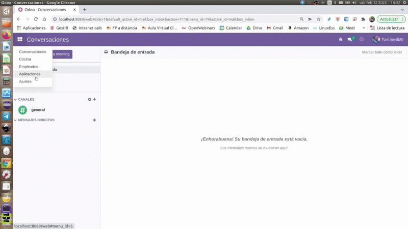
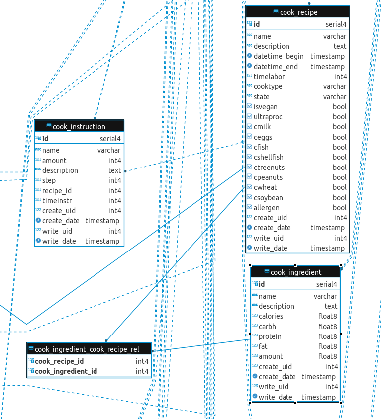
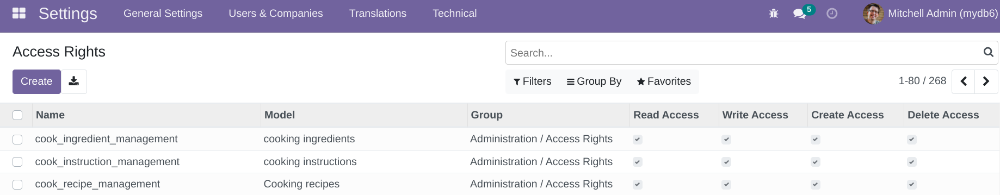
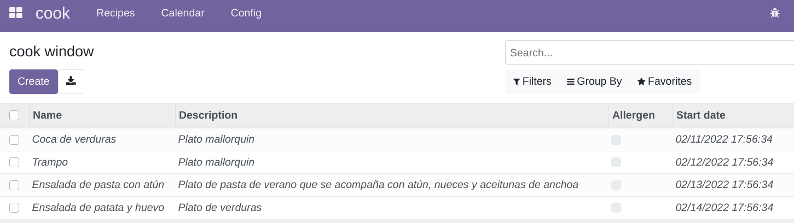

# cookodoo

Cooking module for Odoo 15.0. First version (8th of February 2022)

**How the module works**
+ It has three classes:
  + A main **recipe** class whith One2Many relation with 
  + **instruction** class 
  + And Many2Many relations with **ingredients** class.

+ **Form** and **list** views are available for Recipes, Instructions and Ingredients
+ **Kanban** and **calendar** are available for Recipes
+ In config menu there's an access to ingredients and instructions lists
+ 8 allergen types: allegeren information decorates the recipe table when is true with danger decorator (red color). But requires change to @api.depends decorator after installation. Based on the main eight allergen types (https://www.fda.gov/food/food-labeling-nutrition/food-allergies)
+ Computation of calories based on protein/fat/carbohydrates and amount of food 
+ Demo example of four recipes with instructions (only one of the recipes) and ingredients.
+ Translation languages available: Spanish and Catalan.

**Derived ER diagram (from DBeaver access to postgres DB)**
------

<!--  -->

### To install this module

1. Download the project: 
 + Using git:   git clone https://github.com/tonibois/cook.git
 + Download ZIP
2. Unzip in your odoo/addons folder
3. Launch odoo service using developer mode (./odoo-bin --dev=all -d=mydb -c odoo.conf)
4. Entry on your local odoo using web browser (http://localhost:8069/web/login)
5. If not set developer mode go to settings and at the bottom of the page activate it
6. Go to Apps and Update packates
7. Update list packages
8. You must see the Cook module
9. Install the cook module

### After installing the module set security settings

If not seen automatically the module, you can login as superuser.

To see the module on the menu after installation you can edit Access Rights to the models:

1. Go to: 
 + Settings --> Technical --> Acces Rights 
2. Set the next permissions 

<!--  -->

3. Refresh your web browser

4. You must see it in your list of Apps

*Note: To make @api decorators working properly, after installation of the module you can change the @api.onchange to @api.depends on calories and allergen functions*

