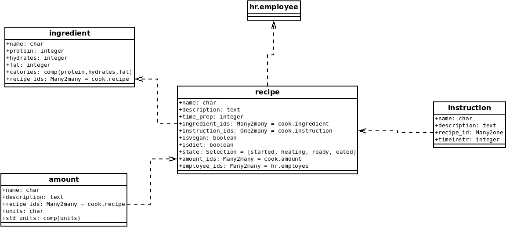

# cookodoo

Cooking module for Odoo 15.0. First version (February 2022)

Based on The next UML Class diagram 

## After installing the module set security settings

1. Go to --> Developer mode --> Technical --> Acces Rights 
2. Set the next permissions 

## Features:

+ Computation of calories based on protein/fat/carbohydrates and amount of food
+ List of recipes
+ List of ingredients
+ List of steps
+ Translation languages: Spanish and Catalan

